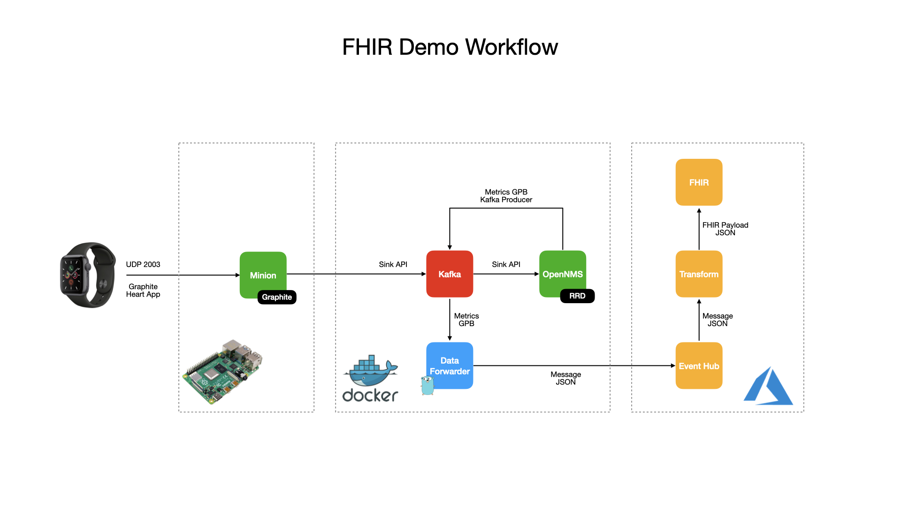

OpenNMS and FHIR
====

The goal of this project is to have a working lab for testing purposes to geneate fake health metrics and forward it to [Azure API for FHIR](https://azure.microsoft.com/en-us/services/azure-api-for-fhir/) via [Event Hub](https://azure.microsoft.com/en-us/services/event-hubs/), as described in the following repository, used as a reference for the work described here:

https://github.com/microsoft/iomt-fhir

## Architecture



The Sample Generator uses the [telemetry_bis.proto](https://github.com/CiscoDevNet/nx-telemetry-proto/blob/master/telemetry_bis.proto) from Cisco, to generate the health metrics using Protobuf the same way a Nexus Switch would do to send streaming telemetry metrics via UDP.

That Protobuf definition is a very generic and vendor-agnostic definition for Telemetry data to send random numbers for Heart Rate and Steps to OpenNMS via Minion.

The reason for this is that OpenNMS already supports receiving and parsing NX-OS Telemetry metrics via UDP. To have a source of data we can use, I decided to reuse this pattern to have a constant stream of data comming into OpenNMS.

The [sample-generator](sample-generator) folder contains the code of it.

The generator sends the UDP data to a Minion, which in turn forwards the data via `Sink API` to OpenNMS.

OpenNMS receives the data via the NX-OS GPB Adapter, and use a simple Groovy Script to parse and persist the data.

It is crucial to notice this solution assumes the usage of `node-level` variables only. Also, the node-label of the sender (i.e., the one that represents the Sample Generator in OpenNMS) will be used as the `Device ID` for `FHIR`.

Then, the Kafka Producer pushes the Collection Sets to a Kafka Topic. From there, the Event Hub Forwarder takes the data, parse it, extract the desired list of metrics (specified via parameters or environment variables when using Docker), and if the metrics were extracted, it forwards the data to Azure Event Hub using the format suggested on:

https://github.com/microsoft/iomt-fhir/blob/master/docs/Configuration.md 

For example:

```json
{
  "Body": {
    "heartRate": "78",
    "stepCount": "100",
    "endDate": "2020-04-29T10:46:01Z",
    "deviceId": "mock-device-001"
  },
  "Properties": {},
  "SystemProperties": {}
}
```

## Run Test Environment

This lab was designed to run with [Docker](https://docker.io), so make sure you have it installed on your system. I recommend 4 Cores with 8 GB of RAM at least, so make your Linux machine, Docker for Mac or Docker for Windows meet these requirements.

It is assume that an Event Hub instance already exists on Azure, with is a Shared Access Policy with Send capabilities, and you have access a connection string for it which is required by the `eventhub-forwarder` to be able to push the translated `CollectionSets` to Event Hub.

Once you have the connection string, declare an environment variable on your machine called `FORWARDER_EVENT_HUB_CONNECTION_STR` with its value, for example:

```bash
export FORWARDER_EVENT_HUB_CONNECTION_STR="Endpoint=sb://onmsfhir.servicebus.windows.net/;SharedAccessKeyName=send;SharedAccessKey=XXXXXXX;EntityPath=fhirhub"
```

Then, you can start the lab using Docker Compose, from the root directory after checking out this repository on your machine:

```bash
docker-compose up -d
```

When OpenNMS is up and running, you should create a requisition with the node that represents the Sample Generator and associate it with the Location used for the Minion, for example:

```bash
cat <<EOF > generate-requisition.sh
#!/bin/sh
LOCATION=Docker
REQUISITION=Test
DEVICE_ID=${DEVICE_ID-mock-device-001}
IP=$(docker container inspect -f '{{range .NetworkSettings.Networks}}{{.IPAddress}}{{end}}' generator)
/opt/opennms/bin/provision.pl requisition add \$REQUISITION
/opt/opennms/bin/provision.pl node add \$REQUISITION \$DEVICE_ID \$DEVICE_ID
/opt/opennms/bin/provision.pl node set \$REQUISITION \$DEVICE_ID location \$LOCATION
/opt/opennms/bin/provision.pl interface add \$REQUISITION \$DEVICE_ID \$IP
/opt/opennms/bin/provision.pl interface set \$REQUISITION \$DEVICE_ID \$IP snmp-primary N
/opt/opennms/bin/provision.pl requisition import \$REQUISITION
EOF
chmod +x generate-requisition.sh
docker cp generate-requisition.sh opennms:/opt/opennms/bin/
docker exec -it opennms /opt/opennms/bin/generate-requisition.sh
rm -f generate-requisition.sh
```

## Verify the solution

To make sure the solution works, inside the [eventhub-forwarder](eventhub-forwarder) directory, there is another directory called [consumer](eventhub-forwarder/consumer). There, you can find a small program that connects to Event Hub and read the messages.

This can be executed standalone, or with Docker:

```bash
docker run -it --rm \
  -e EVENT_HUB_CONNECTION_STR="Endpoint=sb://onmsfhir.servicebus.windows.net;SharedAccessKeyName=listen;SharedAccessKey=XXXXX;EntityPath=fhirhub" \
  agalue/fhir-sample-consumer
```

Note that in this case, the connection string must have `Listen` permissions.

## Clean up

From the root directory after checking out this repository on your machine:

```bash
docker-compose down -v
```

> Make sure the environment variables of the connection strings are set; otherwise the validation and `docker-compose` won't run.

## Pending

At this point, the data is sent to Event Hub, but I haven't been able to test the [transformer files](fhir-mapping) to send data to an FHIR Server.
